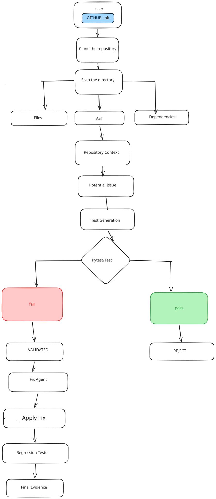

# RepoMind — Ask Before You Break

> **An AI-powered software reliability agent that discovers, reproduces, validates, and fixes bugs in unfamiliar codebases.**

RepoMind is an AI-driven software engineering agent designed to help developers identify potential reliability issues before they become production problems.

Instead of simply asking an LLM to review code and trust its response, RepoMind follows an **execution-based validation loop**:

**Analyze → Detect → Generate Test → Execute → Validate → Fix → Regression Test**

The system analyzes a GitHub repository, identifies potential bugs, generates tests to reproduce them, executes those tests against the actual code, validates the findings using execution evidence, proposes fixes, and verifies the changes through regression testing.

---

## 🎯 Problem

AI coding assistants can generate useful code and identify potential bugs, but their suggestions are often based on static reasoning.

A generated bug report may sound convincing while being incorrect.

Similarly, an AI-generated test may fail because of:

- an incorrect import
- invalid test code
- a missing dependency
- an infrastructure problem
- an incorrect assumption about the repository

RepoMind addresses this problem by making **execution evidence** part of the validation process.

> **Don't just ask AI if something is broken. Run a test and find out.**

---

## 💡 Solution

RepoMind creates an autonomous software reliability workflow around a repository.

Given a GitHub repository, RepoMind:

1. Ingests and scans the repository.
2. Builds repository-level context.
3. Analyzes source code and AST information.
4. Detects potential reliability issues.
5. Generates a test for each finding.
6. Executes the generated test against the repository.
7. Distinguishes between successful reproduction, rejection, and test/infrastructure errors.
8. Generates a potential fix for validated issues.
9. Applies the fix in a controlled manner.
10. Re-runs regression tests.
11. Presents the evidence and results through a web dashboard.

---

# 🔬 Research Idea

RepoMind explores the following research question:

> **Can an AI agent autonomously discover and validate software reliability issues in an unfamiliar codebase using repository-level context and iterative experimentation?**

The key idea is to move from:

**LLM reasoning → conclusion**

to:

**LLM reasoning → hypothesis → executable experiment → evidence → conclusion**

This makes execution a central part of the AI software-engineering loop.

---

# 🏗️ System Architecture

<!-- FLOWCHART PLACEHOLDER -->

> **📌 Architecture / Flowchart**
>
> Add the RepoMind system architecture or workflow diagram here.
>
> Suggested file:
>
 


---

# 🔄 Workflow

 

---

# 🧠 AI Agents

## Bug Hunter Agent

Analyzes repository source code and structural information to identify potential reliability issues.

The agent receives repository-level context instead of relying only on a small code snippet.

### Responsibilities

* Analyze source code
* Use AST/context information
* Identify potential bugs
* Produce structured findings
* Assign severity and confidence information

---

## Test Generator Agent

For each potential finding, the Test Generator creates an executable pytest test designed to reproduce the suspected behavior.

The generated test is validated before execution to prevent invalid AI-generated tests from being treated as evidence.

### Responsibilities

* Generate reproduction tests
* Validate generated test structure
* Detect malformed test output
* Handle unusable generated tests
* Provide executable evidence for the finding

---

## Validation Agent

The Validation Agent interprets the result of executing the generated test.

It distinguishes between:

* Successfully reproduced issue
* Issue not reproduced
* Test-generation errors
* Execution/infrastructure errors
* Cases requiring review

This prevents infrastructure or test-generation failures from being incorrectly classified as confirmed bugs.

---

## Fix Agent

For validated findings, the Fix Agent generates a potential code modification.

RepoMind then:

1. Checks the target code.
2. Applies the proposed modification safely.
3. Re-runs the reproduction test.
4. Runs regression tests.
5. Rolls back the change when validation fails.

A fix is considered verified only when the relevant validation and regression conditions are satisfied.

---

# 🧪 Execution-Based Validation

One of RepoMind's core design principles is that **AI-generated reasoning is treated as a hypothesis rather than proof**.

For example:

```text
Bug Hunter
     │
     ▼
"divide(1, 0) may cause an error"
     │
     ▼
Test Generator
     │
     ▼
def test_divide_by_zero():
    divide(1, 0)
     │
     ▼
Pytest Execution
     │
     ▼
Actual Runtime Evidence
     │
     ▼
Validation
```

This creates a feedback loop between AI reasoning and actual software behavior.

---

# 🖥️ User Interface

<!-- UI SCREENSHOTS PLACEHOLDER -->

## Dashboard

> **📸 Add screenshot here**
>
> `docs/UI/1.png`

<!--

-->

---

## Repository Analysis

> **📸 Add screenshot here**
>
> `docs/UI/2.png`

<!--

-->

---

## Test Evidence

> **📸 Add screenshot here**
>
> `docs/UI/3.png`
> `docs/UI/4.png`


<!--

-->

---

## Fix & Regression Testing

> **📸 Add screenshot here**
>
> `docs/UI/5.png`
> `docs/UI/6.png`


<!--

-->

---

## Final Report

> **📸 Add screenshot here**
>
> `docs/UI/7.png`

<!--

-->

---

# 🧰 Technology Stack

### Frontend

* React
* TypeScript
* Vite
* Tailwind CSS

### Backend

* Python
* FastAPI
* Pytest

### AI

* Ollama
* Qwen2.5-Coder 7B

### Code Analysis

* Python AST
* Repository scanning
* Repository-level context construction

### Testing

* Pytest
* Automated reproduction tests
* Regression testing

### Development

* IBM Bob IDE
* Git
* GitHub


# ⚙️ Installation

## Prerequisites

Make sure the following are installed:

* Python 3.12+
* Node.js
* Git
* Ollama

---

## 1. Clone the repository

```bash
git clone https://github.com/HumaimaRiaz47/repomind.git
cd repomind
```

---

## 2. Set up the backend

```bash
cd backend

python -m venv venv
```

### Windows

```powershell
venv\Scripts\activate
```

Install dependencies:

```bash
pip install -r requirments.txt
```

---

## 3. Configure Ollama

Make sure Ollama is running and the model is available:

```bash
ollama pull qwen2.5-coder:7b
```

Create a `.env` file inside `backend/`:

```env
AI_PROVIDER=ollama
OLLAMA_BASE_URL=http://localhost:11434
OLLAMA_MODEL=qwen2.5-coder:7b
```

---

## 4. Start the backend

From the `backend` directory:

```bash
python -m uvicorn main:app --host 127.0.0.1 --port 8000
```

The API will be available at:

```text
http://localhost:8000
```

---

## 5. Start the frontend

Open another terminal:

```bash
cd frontend
npm install
npm run dev
```

The frontend will be available at:

```text
http://localhost:5173
```

---

# 🔌 API

## Analyze Repository

```http
POST /api/repositories/report
```

Request:

```json
{
  "repo_url": "https://github.com/owner/repository"
}
```

The endpoint runs the RepoMind analysis workflow and returns structured findings, test evidence, validation results, and fix information.

---

# 🧪 Testing

RepoMind contains automated tests covering the major components of the pipeline.

Run the backend test suite:

```bash
cd backend

python -m pytest -q
```

The test suite covers:

* AI client
* Bug Hunter
* Test Generator
* Test Execution
* Validation
* Fix Agent
* Regression testing
* API integration

---

# 🛡️ Reliability & Safety

RepoMind includes several safeguards against incorrect AI conclusions:

### Test validation

AI-generated tests are checked before execution.

### Execution status handling

The system distinguishes between:

```text
passed
failed
skipped
error
timeout
```

### Validation safeguards

Test-generation and infrastructure errors are not automatically interpreted as confirmed bugs.

### Safe fix application

Fixes are checked against the expected source code before modification.

### Rollback

Failed reproduction or regression validation can trigger rollback.

### Regression testing

A fix is not considered verified solely because the patch was generated.

---

# 🤖 IBM Bob Integration

IBM Bob IDE was used as a core development tool for building RepoMind.

Bob was used for:

* Repository inspection
* Architecture analysis
* AI client implementation
* Bug Hunter development
* Test Generator development
* Execution and validation logic
* Fix Agent implementation
* Frontend/backend integration
* Debugging and reliability hardening

RepoMind itself is the resulting software-engineering agent; **IBM Bob was the AI-assisted development environment used to build and iterate on the project.**

Bob usage evidence is included in:

```text
bob_sessions/
```

---

# 📊 Example Result

For a repository containing a vulnerable division function:

```python
def divide(a, b):
    return a / b
```

RepoMind can identify the potential division-by-zero issue, generate a reproduction test, execute it, validate the runtime failure, propose a fix, and perform regression validation.

Example workflow:

```text
Potential Division-by-Zero
          ↓
Generated pytest
          ↓
Test execution
          ↓
Runtime failure reproduced
          ↓
Finding validated
          ↓
Fix generated
          ↓
Regression testing
          ↓
Final result
```

---

# 🚀 Future Improvements

Potential future extensions include:

* Support for additional programming languages
* Multi-file automated fixes
* More advanced dependency analysis
* Security vulnerability detection
* Static analysis integration
* Coverage-guided test generation
* Parallel repository analysis
* Sandboxed execution environments
* Persistent issue tracking
* CI/CD integration
* GitHub pull-request integration
* Support for additional local and hosted LLM providers

---

# 🏆 Hackathon

**IBM Bob 2.0 Hackathon**

RepoMind was developed as a software-engineering workflow powered by AI-assisted development with IBM Bob IDE.

### Project

**RepoMind**

### Tagline

> **Ask Before You Break.**

### Core Concept

> **Execution-based validation of AI-generated software-engineering hypotheses.**

---

# 👩‍💻 Team

**Humaima Riaz**

AI/ML Engineer

---

# 📄 License

This project is developed for the IBM Bob 2.0 Hackathon.

````